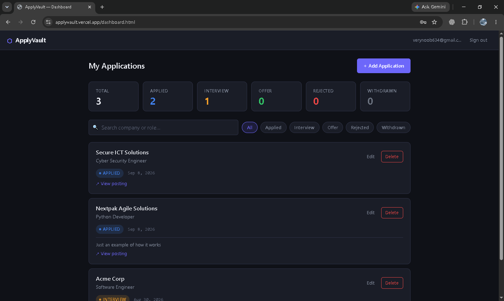

<p align="center">
  
</p>

<h1 align="center">ApplyVault</h1>

<p align="center">A job application tracker built to stop losing track of where you applied.</p>

<p align="center">
  <a href="https://www.python.org/"></a>
  <a href="https://fastapi.tiangolo.com/"></a>
  <a href="https://www.postgresql.org/"></a>
  <a href="https://github.com/Affaniqbal234/applyvault/actions/workflows/ci.yml"></a>
  <a href="LICENSE"></a>
</p>

<p align="center">
  <a href="https://applyvault.vercel.app"><strong>Live Demo</strong></a>
</p>



---

## Stack

- Backend: FastAPI, async SQLAlchemy, PostgreSQL
- Auth: JWT (PyJWT), bcrypt
- Frontend: vanilla HTML/CSS/JS
- Tests: pytest, httpx, Playwright

## Features

- Register and log in with JWT sessions
- Track company, role, status, date applied, notes, and job posting links
- Update status as things progress (Applied, Interview, Offer, Rejected, Withdrawn)
- Search by company or role, filter by status
- Dashboard with live counts per status

---

## Running locally

Requires Python 3.12 (latest security patch) and PostgreSQL.

**1. Clone the repo**

```bash
git clone https://github.com/Affaniqbal234/applyvault.git
cd applyvault
```

**2. Create and activate a virtual environment**

Windows Command Prompt:

```bat
python -m venv .venv
.venv\Scripts\activate
```

macOS / Linux:

```bash
python3 -m venv .venv
source .venv/bin/activate
```

**3. Install dependencies**

From the repository root:

```bash
python -m pip install -r backend/requirements.txt
```

**4. Set up environment variables**

Copy the template from the repository root:

```bat
:: Windows Command Prompt
copy .env.example .env
```

```bash
# macOS / Linux
cp .env.example .env
```

Open `.env` and fill in your values:

```dotenv
DATABASE_URL=postgresql+asyncpg://<user>:<password>@localhost:5432/applyvault
APP_ENV=development
JWT_SECRET=<paste-a-generated-secret-here>
FRONTEND_ORIGIN=http://localhost:5500
```

Generate `JWT_SECRET` with `python -c "import secrets; print(secrets.token_urlsafe(48))"`.
Secrets must contain at least 32 bytes. Keep `.env` outside Git.

Use your local PostgreSQL credentials. Create an empty database named `applyvault`
in pgAdmin or with `createdb -U <user> applyvault`.

**5. Migrate the database and start the API**

From the repository root:

```bash
cd backend
python -m alembic upgrade head
uvicorn main:app --reload
```

Startup does not change the schema. Run migrations before starting the API or
releasing a new version. If the database already contains ApplyVault tables,
follow the [database adoption procedure](docs/database-migrations.md) first.

**6. Serve the frontend**

In a second terminal, from the repository root:

```bash
cd frontend
python -m http.server 5500
```

Then open `http://localhost:5500/index.html` in your browser.

See [deployment configuration](docs/deployment.md) for hosting settings.

---

## Tests

The backend and browser suites use isolated SQLite databases and need no
PostgreSQL setup. With the virtual environment active, start from the repository root:

```bash
cd backend
python -m pip install -r requirements-dev.txt
python -m pytest tests/ -v
```

Browser tests cover rendering safety, API configuration, and request state using
headless Chromium and the backend. From the same `backend/` directory:

```bash
python -m pip install -r requirements-browser.txt
python -m playwright install chromium
python -m pytest browser_tests/ -v
```

On Linux, use `python -m playwright install --with-deps chromium` to install the
browser's system dependencies too.

PostgreSQL integration tests cover migrations, database constraints, existing
database adoption, and persistence after an API restart. They create a disposable
cluster and never target your configured `DATABASE_URL`. Install PostgreSQL
binaries and add their `bin` directory to `PATH`, or set `POSTGRES_BIN` to that
directory. From the repository root:

```bash
python -m pytest integration_tests/ -q
```

Missing PostgreSQL binaries fail the integration tests. [GitHub Actions](https://github.com/Affaniqbal234/applyvault/actions/workflows/ci.yml)
runs all three suites, JavaScript syntax checks, and a production dependency audit.
CI uses Python 3.12 and PostgreSQL 16.
